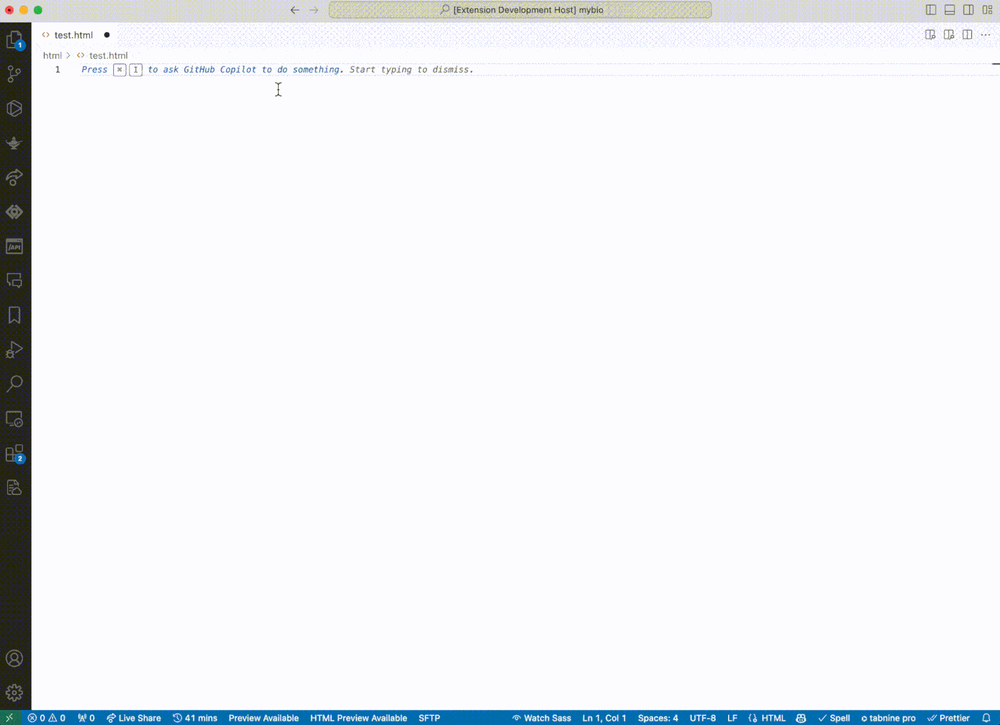
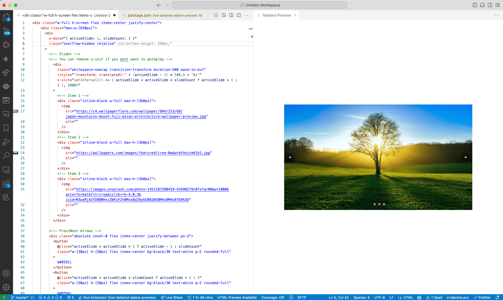

# Live HTML Previewer with Tailwind/AlpineJs Support
This extension allows you to preview html files with TailwindCSS and AplineJS support in VS Code itself.

#### Now Supporting Liquid Language Files Preview for Shopify

### Features

* Now supporting Liquid Language files preview and additional JS or CSS files throughout the extension settings
* Live Preview of Any file that may contain html markup (not limited to html)
* Using Play CDN for tailwind and AlpineJs CDN
* To support custom tailwind config or plugins 

```
window.addEventListener('DOMContentLoaded', function () {
    tailwind.config = {
        darkMode: 'class',
        prefix: 'tw-',
    }
});
```

#### For Liquid Files, Example:
Click on a .liquid file and click show preview, you will have to add the script below in your liquid file or using the extra .js file in the extension setting, This will allow the extension to map the json to liquid [https://liquidjs.com] and preview the template with the loaded json
```
// Template
{{ product.metafields.reviews.count }}: {{ product.metafields.reviews.rating.value }}, {{ product.metafields.reviews.rating.value.rating }}
```
```
// Add this to either the extension js files setting or in your liquid file (wrap it with <script>)
window.onLiquid = function (liquidjs) {
	class ValueDrop extends liquidjs.Drop {
		scale_max = 1;
		rating = 10;
		valueOf() {
			return this.rating;
		}
	}
	return {
		product: {
			metafields: {
				reviews: { 
                    count: 10,
					rating: {
						value: new ValueDrop(),
					},
				},
			},
		},
	};
};

// By default the root folder is in ../snippets directory relative to the current file
window.onLiquidRoot = function(root){
    return root + '/../testfolder'
}

```

#### Side preview with live editing (Tailwind and Alpinejs support)

#### Side preview with aplinejs support

#### Full page preview
### Usage
* For side preview, use the keybinding 'ctrl+q s' or press 'F1' and type "Show tailwind side preview"
* For full preview, use the keybinding 'ctrl+q f' or press 'F1' and type "Show tailwind full preview"

If a HTML file is open, an icon is displayed on the Status Bar in bottom left. Click on it for side preview.

## Changelog

### [1.0.9](https://github.com/n-for-all/live-tailwind-alpine-preview) Support for Liquid Language (2024-10-15)
### [1.0.8](https://github.com/n-for-all/live-tailwind-alpine-preview) Fixes and changes (2024-10-15)
### [1.0.5](https://github.com/n-for-all/live-tailwind-alpine-preview) (2024-06-12)


### Changes

* Enable error debugging and output to console
* Supporting loading images from disk
